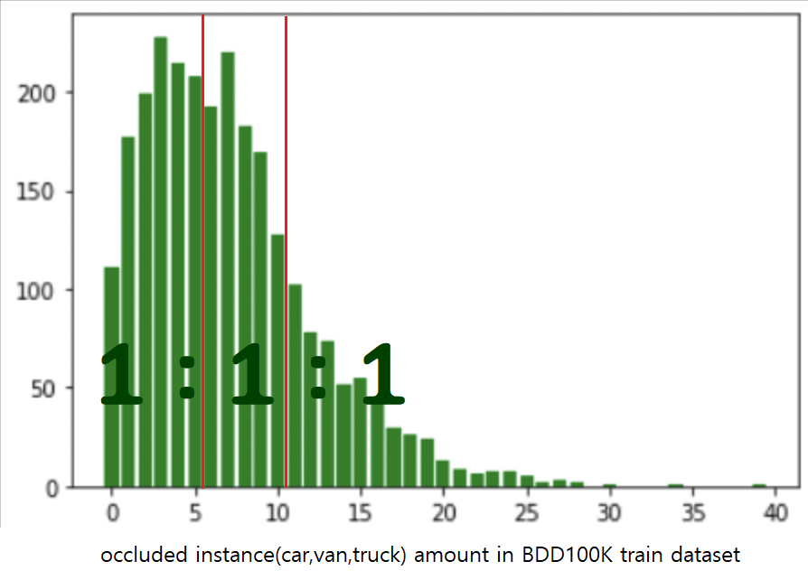

# validation result 

## validation dataset
- BDD100K의 train데이터셋 전부를 val dataset으로 사용하였습니다.
- 가려진 객체(car,van,truck)의 개수가 '0-5', '0-10', '0-전체'인 데이터셋으로 분리하여 검증했습니다.
- '0-5', '0-10', '0-전체'는 가려진 객체의 비율(1:1:1)로 나누어 결정하였습니다.

## kitti + vkitti + cycleGAN mAP@0.5 result
|occlusion amount|baseline|ours(cycleGAN)|
|:--:|:--:|:--:|
|0~5|0.379|**0.413**|
|0~10|0.358|**0.387**|
|0~all|0.342|**0.365**|

## kitti + vkitti + Neural Style Transfer mAP@0.5 result
|occlusion amount|baseline|ours(NST)|
|:--:|:--:|:--:|
|0~5|ㅁㄴㅇㄹ|ㅁㄴㅇㄹ|
|0~10|ㅁㄴㅇㄹ|ㅁㄴㅇㄹ|
|0~all|ㅁㄴㅇㄹ|ㅁㄴㅇㄹ|

> 합성데이터에 환경정보를 추가한 데이터셋의 가려진 객체 탐지에 있어서 성능 향상이 있음을 확인할 수 있습니다.

# reference 

[1] [Structured Domain Randomization: Bridging the Reality Gap by
Context-Aware Synthetic Data](https://arxiv.org/pdf/1810.10093.pdf)

[2] [Photorealistic Style Transfer via Wavelet Transforms](https://openaccess.thecvf.com/content_ICCV_2019/papers/Yoo_Photorealistic_Style_Transfer_via_Wavelet_Transforms_ICCV_2019_paper.pdf) 

[3] [Unpaired Image-to-Image Translation using Cycle-Consistent Adversarial Networks](https://arxiv.org/pdf/1703.10593.pdf)

[4] [KITTI : Object Scene Flow for Autonomous Vehicles](http://www.cvlibs.net/publications/Menze2015CVPR.pdf)

[5] [Virtual KITTI 2(Cabon, Yohann and Murray, Naila and Humenberger, Martin)](https://arxiv.org/pdf/2001.10773v1.pdf)

[6] [BDD100K : A Diverse Driving Dataset for Heterogeneous Multitask Learning](https://arxiv.org/pdf/1805.04687.pdf)

[7] https://github.com/sukkritsharmaofficial/NEURALFUSE

[8] https://github.com/junyanz/pytorch-CycleGAN-and-pix2pix

[9] https://github.com/ultralytics/yolov5